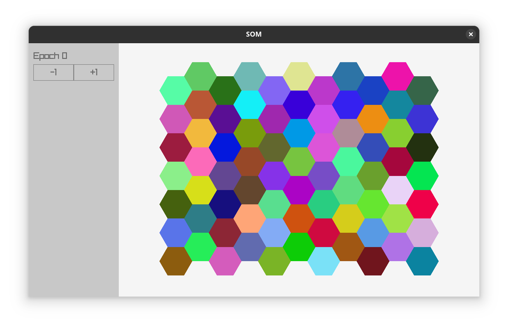
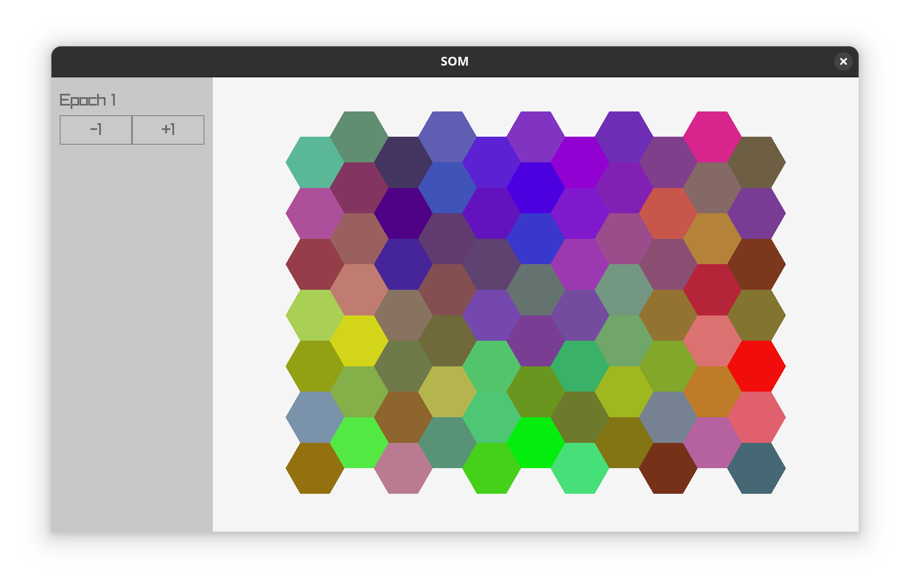
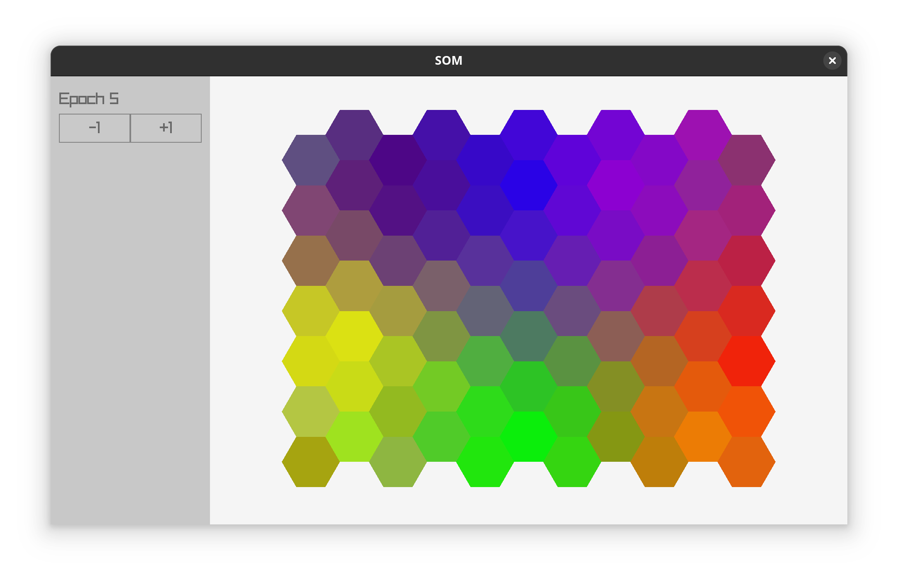
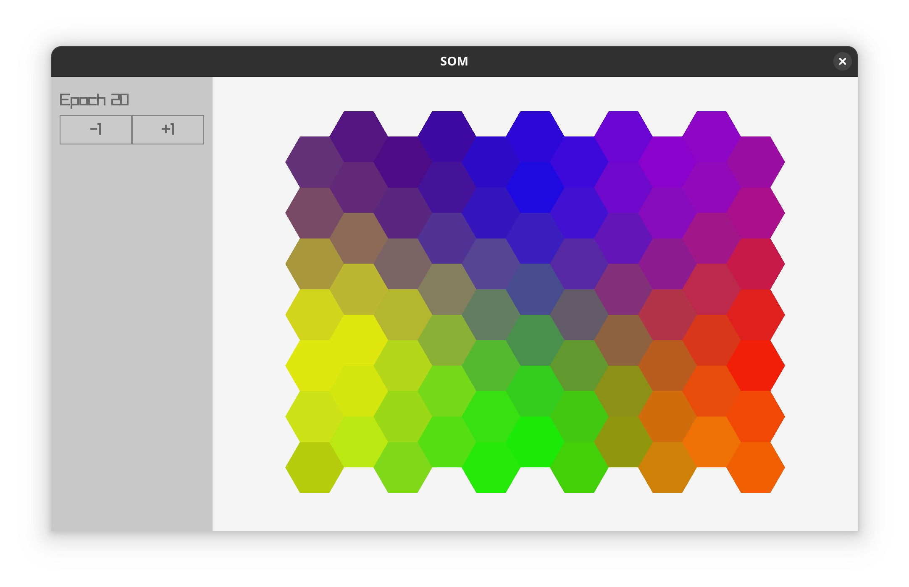

# Self-organizing map

An application that illustrates how the self-organizing map (SOM) works through color data.

The SOM is trained with ROYGBIV colors for 20 epochs when the application is started up and for each epoch a snapshot of the state of the neurons is saved. The neuron snapshots can be cycled through in the application to see how the map converges to form different areas that are each sensitive to some specific color.

## Building

Requires `raylib` and `raygui`, tested with versions 5.5 and 4.0, respectively. After downloading and unpacking the releases to this directory, you can build the application like this:

```bash
$ g++ -std=c++20 -o som som.cc -Wall -Wextra -Werror -isystem ./raygui-4.0/src -isystem ./raylib-5.5_linux_amd64/include -L ./raylib-5.5_linux_amd64/lib -l:libraylib.a
```

## Running

Run the built executable as you would expect:

```bash
$ ./som
```

## Example screenshots

Here is an example of the generated SOM in it's initial randomized state and after 1, 5 and 20 training epochs.






